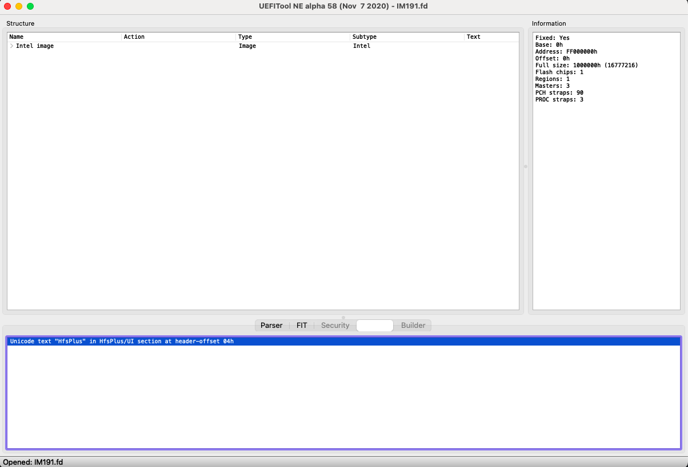

# Estrazione driver UEFI da BIOS ufficiali Apple

Questa guida mostra gli step necessari per ottenere le ultime versioni dei driver presenti in [OcBinaryData](https://github.com/acidanthera/OcBinaryData).

## Step 1: Ottenere l'installer

1. Eseguire questo comando per ottenere l'installer dal catalogo ufficiale (`swdist.apple.com`) in questa guida considereremo che l'utente scarichi l'ultima versione disponibile, ma la scelta è vostra, considerate il fatto che l'ultima versione dell'installer contiene l'ultima versione dei BIOS che vanno poi aggiornati quando si aggiorna il sistema operativo nei Mac originali.

    ```
    cd /Users/Shared
    curl -O https://raw.githubusercontent.com/munki/macadmin-scripts/main/installinstallmacos.py
    sudo python installinstallmacos.py
    ```

    **Nota**: È importante che la cartella di lavoro dello script sia `/Users/Shared` per il fatto che potrebbero esserci dei problemi di permessi quando lo script viene eseguito nelle cartelle sotto `~/` (la vostra `home` directory)

2. Quando lo script avrà finito, aprite il `Finder` e con la shortcut `CMD + Shift + G` vi si aprirà un menu che vi chiederà il percorso a cui dirigervi, scrivete appunto `/Users/Shared`. Oppure, se si vuole fare la stessa cosa da terminale, una volta che lo script ha finito, digitare `open .` 

## Step 2: Estrazione degli EFI Payloads da dentro l'installer

1. Installate [Pacifist](https://charlessoft.com/cgi-bin/pacifist_download.cgi?type=dmg) e dirigetevi nel percorso in foto, che conterrà gli ultimi BIOS dei firmware dei Mac originali

    
    
2.  Ora occorre estrarre questa cartella, cliccando su `Extract to custom location` vi verrà chiesto di scegliere il percorso, in questo caso io ho scelto la cartella `~/Downloads`.

    

3. Una volta estratti, possiamo chiudere Pacifist e siamo pronti per ispezionare i file `.fd` poter utilizzarli poi con il prossimo applicativo, [UEFITool](https://github.com/LongSoft/UEFITool/releases/latest). Assicuratevi di selezionare su `UEFITool` e **non** su `UEFIExtract` o `UEFIFind`

## Step 3: Estrazione del driver da dentro il file .fd

In questa guida utilizzeremo il file `IM191.fd`, essendo uno degli ultimi usciti.

1. Aprite UEFITool, e trascinateci sopra il file `.fd` come in foto:

    

2. Ora con la shortcut `CMD F` o `Ctrl F` se siete su Linux o Windows, vi si aprirà un menu, cliccate su `Text`e cercate il driver desiderato, in questa guida estrarremo `HfsPlus` che è molto più performante dei driver HFS+ presenti ora come `VboxHfs` o `OpenHfsPlus` - ma potete fare lo stesso anche per altri driver se volete sperimentare.

    

3. Premete invio, e vedrete che comparirà una stringa in basso, cliccateci *due volte*:

     


4. Cliccandoci due volte, UEFITool vi dirigerà sul risultato della ricerca, qui dovrete estrarre la `PE32 Image Section` con `Extract Body` ed il gioco è fatto, l'applicativo vi chiederà dove salvare il driver `.efi` 

     

5. Dategli un nome riconoscibile (basta poi essere coerenti quando si inserisce il nome del driver dentro il `config.plist` di OpenCore, e aver messo il driver in `EFI/OC/Drivers`)

In questo modo, siete sicuri di avere l'ultima versione di `HfsPlus.efi` che proviene dai canali ufficiali di Apple, essendo l'installer stato scaricato da catalogo.

# Credits

- [Apple](https://apple.com) per macOS e per aver scritto questi BIOS
- [Acidanthera](https://github.com/acidanthera) per aver confermato questa procedura con cui ho smanettato personalmente ^_^
